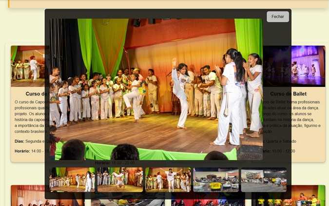
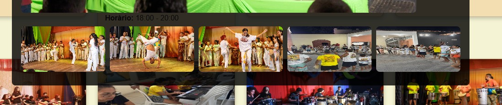
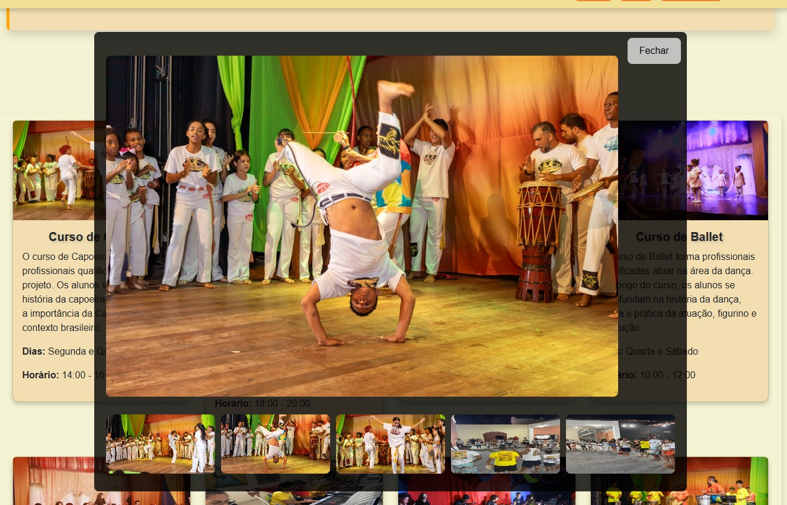

# Escola de Arte

**Descrição do Projeto**:  
Este é um projeto para gerenciar as inscrições e usuários de uma escola de arte. A aplicação permite que os usuários se inscrevam, façam login e interajam com o sistema de forma simples e intuitiva.

----------

## Funcionalidades

-   **Cadastro de usuários**: Permite que os usuários se cadastrem no sistema com e-mail e senha.
-   **Login e logout**: Sistema de autenticação de usuários, incluindo redefinição de senha.
-   **Painel administrativo**: Acesso exclusivo para administradores para gerenciar inscrições.
-   **Interface responsiva**: A aplicação é otimizada para ser usada em dispositivos móveis e desktops.

----------

## Novidade: Galeria Interativa

Agora, o projeto conta com uma **galeria interativa** para visualização das imagens de cada curso! Os alunos podem clicar nas fotos dos cursos para visualizá-las em um formato de galeria, e navegar entre as imagens clicando nas fotos do roda-pé.

### Como funciona:

1.  **Visualização das Imagens**: Ao clicar em uma imagem de um curso, uma galeria se abrirá exibindo a imagem selecionada.
    
2.  **Navegação entre as Imagens**: O usuário pode navegar entre as imagens clicando nas imagens do roda-pé.

## Imagens da Galeria:

1. **Imagem Principal Inicial**:
   

2. **Miniaturas da Galeria**:
   

3. **Imagem Atualizada ao Clicar na Miniatura**:
   
    
### Como testar a funcionalidade:

1.  Acesse a página do curso.
    
2.  Clique em qualquer imagem para abrir a galeria.
    
3.  Clique nas imagens para alterá a visualização na galeria.
    

### Tecnologias Usadas nesta vova interação:

-   HTML
    
-   CSS (com uso do Bootstrap para o layout responsivo)
    
-   JavaScript (para a interatividade da galeria)

## Tecnologias Usadas

-   **Django**: Framework web Python para desenvolvimento rápido.
-   **Bootstrap**: Framework CSS para design responsivo e moderno.
-   **SQLite**: Banco de dados local (será migrado para PostgreSQL no futuro).
-   **Git & GitHub**: Controle de versão e repositório de código.

----------

## Como Rodar o Projeto Localmente

### 1. **Instale as dependências**

Com o ambiente virtual ativado (recomenda-se o uso de um ambiente virtual para isolar dependências), instale as dependências com o comando:

bash

CopiarEditar

`pip install -r requirements.txt` 

### 2. **Clone o repositório**

Clone o repositório do GitHub para a sua máquina local com o seguinte comando:

bash

CopiarEditar

`git clone https://github.com/Megadurck/escola_arte.git` 

### 3. **Configure o banco de dados**

Execute as migrações para criar as tabelas no banco de dados local (SQLite). No futuro, o banco de dados será migrado para PostgreSQL. Para realizar a migração, execute:

bash

CopiarEditar

`python manage.py migrate` 

### 4. **Crie um superusuário (opcional)**

Se você deseja acessar o painel administrativo, será necessário criar um superusuário. Execute o comando abaixo e siga as instruções para definir o nome de usuário, e-mail e senha:

bash

CopiarEditar

`python manage.py createsuperuser` 

### 5. **Inicie o servidor**

Com tudo configurado, inicie o servidor local do Django com o seguinte comando:

bash

CopiarEditar

`python manage.py runserver` 

### 6. **Acesse o site**

Abra seu navegador e acesse o seguinte link:

[http://127.0.0.1:8000](http://127.0.0.1:8000)

----------

## Contribuindo

1.  **Fork o repositório**: Crie uma cópia do repositório no seu GitHub.
2.  **Crie uma branch**: Navegue até o repositório clonado e crie uma nova branch para implementar suas alterações.

bash

CopiarEditar

`git checkout -b feature/nova-funcionalidade` 

3.  **Faça as alterações e commit**: Realize as alterações no código e faça o commit com uma mensagem explicativa.

bash

CopiarEditar

`git commit -am 'Adicionando nova funcionalidade'` 

4.  **Envie a branch para o seu fork**: Após o commit, envie a branch para o seu repositório remoto.

bash

CopiarEditar

`git push origin feature/nova-funcionalidade` 

5.  **Abra um Pull Request**: Acesse o repositório original e abra um Pull Request explicando as mudanças que você fez.

----------

## Licença

Este projeto está licenciado sob a **Licença MIT**. Para mais informações, consulte o arquivo LICENSE no repositório.
